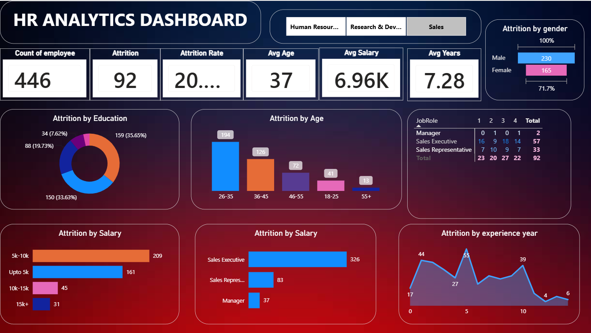

# HR Analytics Dashboard

An interactive Power BI dashboard designed to analyze employee attrition, demographic trends, and key HR metrics.

## Dashboard Preview

## Project Overview
This project tracks critical human resources KPIs to identify the underlying drivers behind employee attrition across various departments.

### Key Features & Visualizations Built:
* **Attrition Analysis**: Visualized attrition rates broken down by Education background, Age demographics, and Job Roles.
* **Salary Correlation**: Developed clustered bar charts to analyze how compensation brackets affect employee retention.
* **Dynamic KPIs**: Built card visuals tracking total headcount (1.47K), historical attrition count (237), and an overall attrition rate of 16.1%.
* **Data Modeling**: Utilized Power Query for data cleansing and structured relationship lines to enable seamless cross-filtering across visuals.
